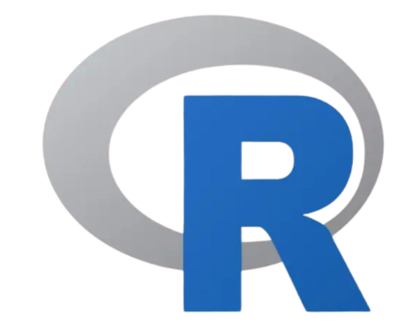
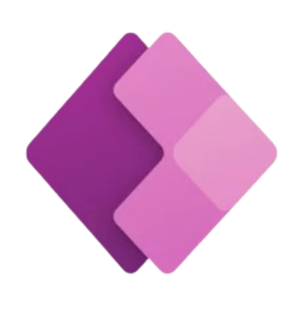
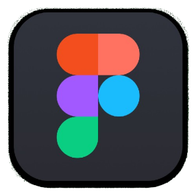
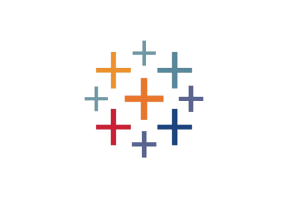
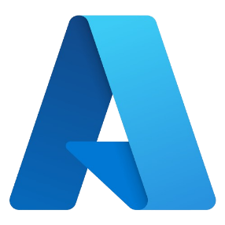
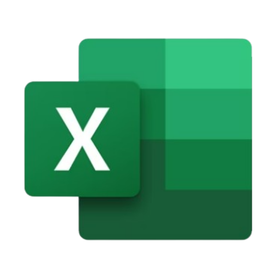
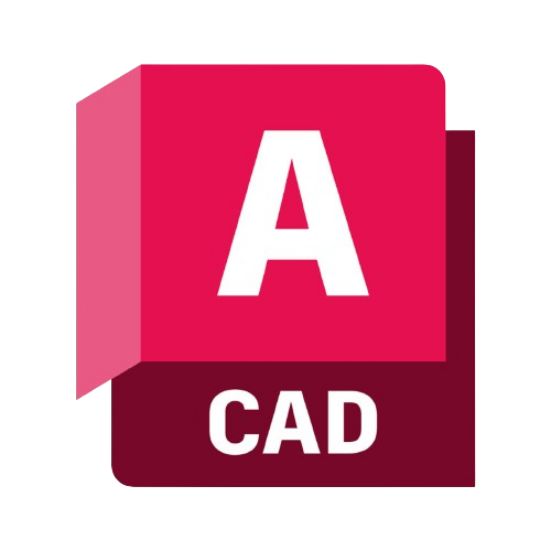
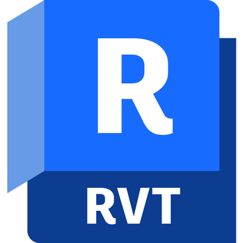

# 👋 Hello, I'm Kousalya!

Hi, I'm Kousalya Potti. I'm studying Information Science at the University of Maryland with a focus on data science, business analytics, and project management. I love working on creative and impactful tech projects — from visualizing cybersecurity threats and decoding drone signals to building user-friendly tools with Power Apps and Figma. I'm currently diving deeper into systems and algorithms through CodePath’s Technical Bootcamp. I'm driven by the goal of making a big impact through my work and always looking to grow, learn, and collaborate on projects that matter.

---

### 📫 Connect with me:

---

### 💻 Programming Languages:

  
  
  
  
  

---

### 🛠️ Software and Tools:

  
  
  
 
  
  
  
  
  
  
  
  
  
  

---

## 🚀 Projects

- **The Mane Box** – Python-based hair care subscription recommender using user preferences and scraped product data.
- **SafeTravels App** – UI/UX wireframe for a travel safety platform built in Figma with role-based access and alert notifications.
- **Transit Equity Database** – SQL + Tableau analysis of transit-oriented development and accessibility scores in Maryland.

---

## 📜 Certifications

AWS Cloud Practitioner • Microsoft Azure Fundamentals • Google Project Management  
IBM SQL for Data Science • Meta Front-End Development • Tableau • Oracle Database Foundations

---

## 🌱 Currently Learning

- Data Structures & Algorithms through CodePath Technical Bootcamp  
- Full-stack Python/SQL projects  
- Cloud tools like AWS and Azure

---
