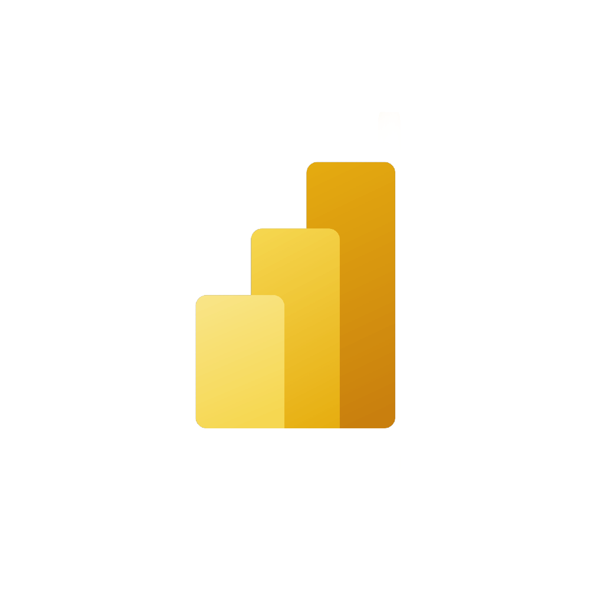
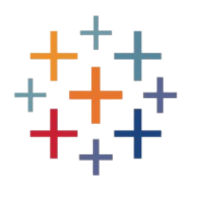

# 👋 Hello, I'm Kousalya!

Hi, I'm Kousalya Potti. I'm studying Information Science at the University of Maryland with a focus on data science, business analytics, and project management. I love working on creative and impactful tech projects — from visualizing cybersecurity threats and decoding drone signals to building user-friendly tools with Power Apps and Figma. I'm currently diving deeper into systems and algorithms through CodePath’s Technical Bootcamp. I'm driven by the goal of making a big impact through my work and always looking to grow, learn, and collaborate on projects that matter.

---

## Programming Languages:

 
   <!-- Python -->
  
   <!-- SQL -->
   
   <!-- JavaScript -->
   
   <!-- Java -->
  <a href="https://www.java.com" target="_blank" rel="noreferrer"> 
     
   <!-- R -->
  <a href="https://www.r-project.org/" target="_blank" rel="noreferrer"> 
     

---

## Software and Tools:

  
 
  <!-- Microsoft Power Apps -->
  
 <!-- Power BI -->
 
   <!-- Power Automate -->
   
  <!-- Figma -->
 
  <!-- Tableau -->
  
  <!-- AWS -->
  
  <!-- Azure -->
  
  <!-- Microsoft Word -->
  
  <!-- Microsoft PowerPoint -->
  
  <!-- Microsoft Excel -->
  
  <!-- AutoCAD -->
  
  <!-- Autodesk Revit -->
  
  <!-- Canva -->
  

---

## Projects

- **The Mane Box** – Python-based hair care subscription recommender using user preferences and scraped product data.
- **SafeTravels App** – UI/UX wireframe for a travel safety platform built in Figma with role-based access and alert notifications.
- **Transit Equity Database** – SQL + Tableau analysis of transit-oriented development and accessibility scores in Maryland.

---

## Certifications

- AWS Cloud Practitioner
- Microsoft Azure Fundamentals
- Google Project Management
- IBM SQL for Data Science
- Meta Front-End Development
- Oracle Database Foundations

---

## Currently Learning

- SQL50 through Leetcode
- Data Structures & Algorithms through CodePath Technical Bootcamp  
- Full-stack Python/SQL projects  
- Cloud tools like AWS and Azure

---

## Connect with me:

---
